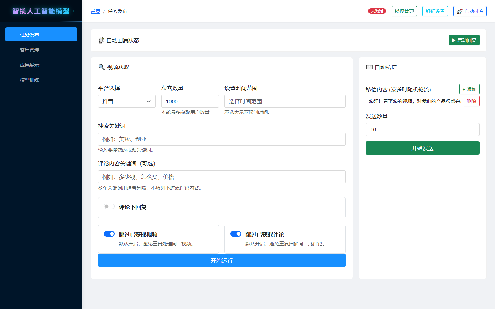
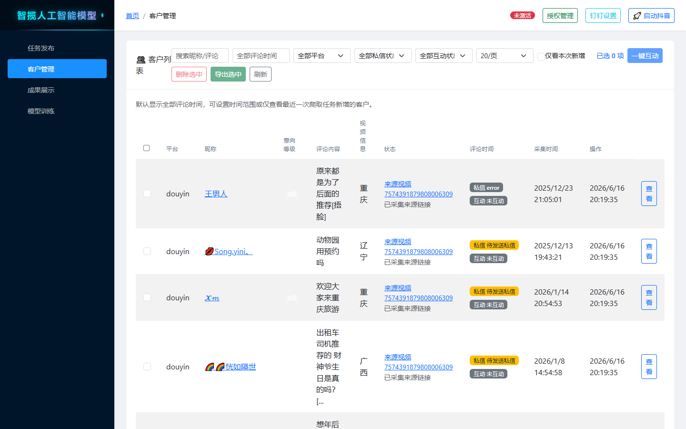
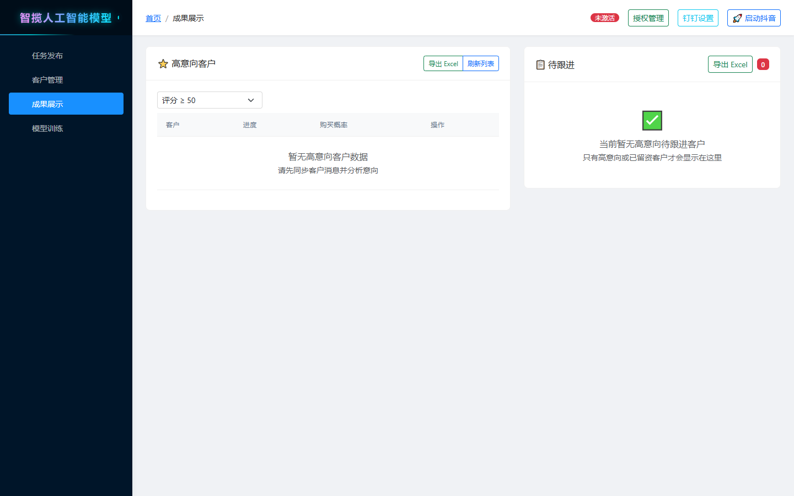
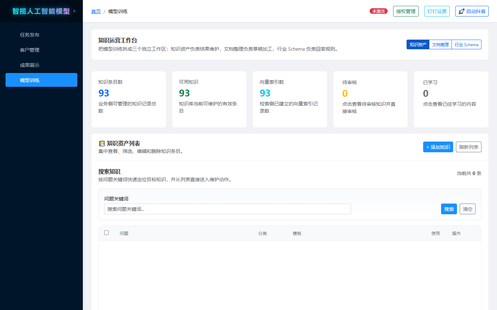

# 功能介绍

智揽人工智能模型（Huoke Smart Bot）是一个面向抖音平台的自动化智能客服与获客系统。系统通过 RPA 模拟真人操作完成搜索、爬取、私信等动作，并通过 RAG 检索增强与大模型实现高质量的自动回复。

Web 管理台包含四大工作区：**任务发布、客户管理、成果展示、模型训练**。

---

## 1. 任务发布（获客主控）

核心获客工作台，配置并运行自动化获客任务：

- **自动回复状态**：一键「启动回复」，开启私信自动应答
- **视频获取**：
  - 平台选择（当前支持抖音）
  - 获客数量：本轮最多获取的用户数量
  - 时间范围：可选，不选表示不限时间
  - 搜索关键词：多关键词逗号分隔
  - 评论内容关键词（可选）：只保留包含指定关键词的评论，如「多少钱、怎么买、价格」
  - 跳过已获取视频 / 跳过已获取评论：避免重复处理同一视频或评论
- **自动私信**：
  - 私信内容支持多条轮流发送（随机轮询），可添加/删除
  - 发送数量控制
- **评论下回复**：支持对目标评论自动回复
- **开始运行**：启动 RPA 引擎，浏览器自动执行搜索 → 进入视频 → 采集评论 → 识别意向 → 私信触达

### 背后的技术

- **CloakBrowser 持久化上下文**：直启浏览器并保留登录态，降低风控触发
- **随机延时与人类行为模拟**（`human_interaction.py`）：滚动、停顿、输入节奏随机化
- **API 拦截器**（`api_interceptor.py` / `search_api_interceptor.py` / `comment_api_interceptor.py`）：直接拦截平台接口响应，比 DOM 解析更稳定
- **智能爬取 Agent**（`crawl_intelligent/`）：视频发现、评论爬取、私信发送、结果校验等子 Agent 协作，支持页面状态识别与任务分解

## 2. 客户管理

采集到的客户统一管理：

- **客户列表**：平台、昵称、意向等级、评论内容、视频信息、来源视频链接、评论/采集时间
- **多维筛选**：昵称/评论搜索、评论时间、平台、私信状态、互动状态
- **仅看本轮新增**：只显示本次任务新增的客户
- **批量操作**：删除选中、导出 Excel
- **客户详情**：点击「查看」进入客户会话与画像详情

### 背后的技术

- **SQLite 消息存储**（`chat_store.py` / `database.py`）：客户与会话持久化
- **购买意向分析**（`purchase_intent_analyzer.py`）：基于评论内容、互动行为打分
- **高级评分**（`advanced_scoring.py` / `ml_scoring.py`）：多因子意向评分模型

## 3. 成果展示（意向分析）

获客成果与营销跟进：

- **高意向客户**：按意向评分阈值（如 ≥ 50）筛选，支持导出 Excel、刷新列表
- **待跟进**：标记为需人工跟进的客户清单
- **营销追踪**（`marketing_tracking_service.py`）：私信发送、回复、转化全链路记录

## 4. 模型训练（知识运营工作台）

知识库全生命周期管理，提升自动回复质量：

- **统计看板**：知识条目数、可用知识、向量索引数、待审核、已学习
- **知识资产列表**：按问题关键词搜索、批量编辑/删除
- **文档整理**：上传 Word/PDF/Excel 等文档，自动结构化、语义分块入库
- **行业 Schema**：按行业（如旅游）配置问答模板与答客规则
- **审核与学习闭环**：LLM 抽取候选知识 → 人工审核 → 入库学习 → 冲突检测与知识衰减

### 背后的技术

- **语义分块**（`semantic_chunker`）+ **文档结构化**（`document_structuring_service.py`）
- **混合检索管线**（`rag/unified_pipeline.py`）：向量检索（ChromaDB + BGE）+ BM25 + 交叉编码器重排序 + 语义缓存
- **知识图谱**（`knowledge_graph.py` + NetworkX）：实体关系抽取与图谱查询
- **自学习 RAG**（`self_learning_rag.py`）：根据用户反馈持续优化检索与回复

## 5. 智能客服引擎

贯穿各模块的核心能力：

| 能力 | 说明 | 关键模块 |
|---|---|---|
| 意图识别 | BERT 分类 + 层级意图 + LLM 兜底，置信度计算 | `intent_recognizer.py`、`bert_intent_recognizer.py` |
| 多轮对话 | 上下文窗口管理、指代消解、对话状态维护 | `multi_turn_dialogue_manager.py`、`context_understanding.py` |
| 回复编排 | 回复路由、资格判定、质量守门、兜底策略 | `reply_orchestrator.py`、`guardrail_stage.py` |
| LLM 服务 | Ollama 本地模型为主，云端 API 兜底，超时降级 | `llm_service.py`、`rag/ollama_service` |
| 企业组件 | 熔断器、消息总线、会话管理、配置中心 | `common/enterprise/` |

## 6. 企业级与运维特性

- **授权许可**（`licensing/`）：机器指纹 + Ed25519 签名授权，Web 端「授权管理」入口
- **远程策略控制**（`remote_control/`）：远程下发运行策略
- **监控告警**：Prometheus 指标（`config/prometheus.yml`）、告警规则（`config/alerts.yml`）、钉钉通知
- **进程管理**（`common/process_manager/`）：浏览器/爬虫子进程生命周期管理，防止卡死
- **健康检查与 API 文档**：`/health`、FastAPI 自动 Swagger 文档
